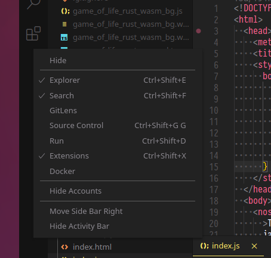
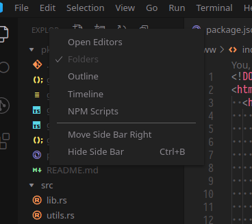
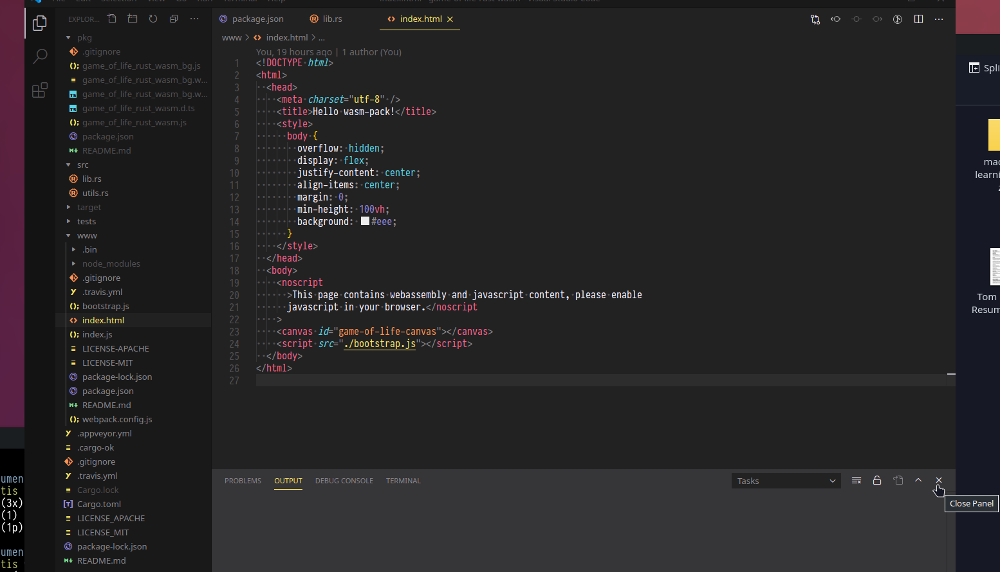

# Markdown

Markdown is a simple file format which is both simple enough to read and write in plain text.

It is one of the most common ways that people write notes, checklists, posts and much more, and is a valuable tool to have.

Variants of it are used in everything including Slack, Discord, Telegram, Github, Nextcloud, and it is useful for writing HTML quickly;
for example, with formatted emails. 

---

Links:

- The original syntax: https://daringfireball.net/projects/markdown/
- Common markdown extensions (the ones in the table of contents with `(extension)`): https://github.github.com/gfm/
- A simple markdown editor: http://markdown.pioul.fr/
- A cool interactive tutorial: https://commonmark.org/help/tutorial/

---

# Setting up our editor

The editor we will use is `Visual Studio Code`. (Sometimes called `VS Code` and (v. rarely) `Code`).

It is actually made by Microsoft - which seems bad...

...but it's not - they actually did a pretty good job for once.

VS Code, like many other tools developed these days, is written using Electron, i.e. a Chrome window in a box.
This means that it sometimes uses a lot of system memory (a.k.a. RAM), meaning that for devices with 8GB RAM or less your
computer may slow to a grind if you have more than about 3 programs (terminal + editor + browser with 8 tabs or less) open at once.

It's strongly advised to close unnecessary browser windows and tabs as you will really feel it!

---

VS Code has a lot of noise for new devs, and is pretty overwhelming.

We can take a lot of that noise away with a few simple steps:

1. Hiding some items from the left-most sidebar
  - Right click the left-most sidebar and leave 'Explorer', 'Search' and 'Extensions' checked, and uncheck the rest

 
2. Hiding some sections of Explorer
  - With the Explorer (with the icon of files) tab open, right click the top part of the Explorer sidebar and leave only 'Folders' checked, and uncheck the rest

3. Most of the time, the bottom section contains things you don't need to, and when they need your attention, they open up by themselves.
   So we can hide it.
  - Click the close button on the bottom section

Simples.

---

Now finally an exploratory challenge.

Checklist:

- Open a folder of files
- Find a txt, csv, md, or other text file and view it. Change it and save it.
- Find a png, jpg or pdf and open it. What happens?
- Find an extension you'd like and install it. (if unsure, try and find a markdown one)
